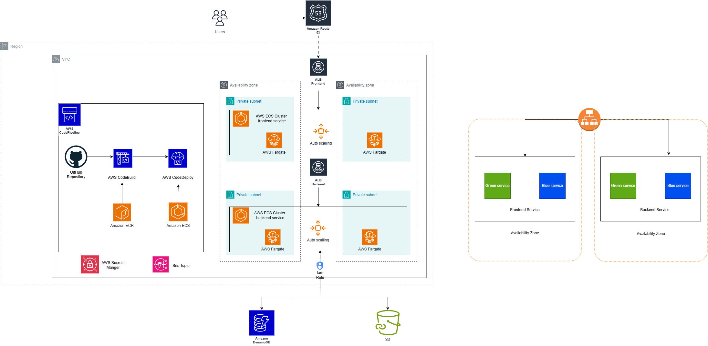

# Amazon ECS Demo: Fullstack App with Infrastructure as Code

## Overview

This project demonstrates a production-grade AWS architecture for containerized applications using Terraform and ECS. It automates deployment of a Vue.js frontend and Node.js backend with CI/CD via AWS CodePipeline, including Blue/Green deployments, autoscaling, and infrastructure monitoring.

## Architecture

<p align="center">
  
</p>

The infrastructure deploys:
- **Networking**: Multi-AZ VPC with public/private subnets
- **Compute**: ECS Cluster with 2 services (frontend & backend)
- **CI/CD**: CodePipeline → CodeBuild → CodeDeploy with Blue/Green strategy
- **Storage**: ECR repositories, S3 buckets (artifacts + assets), DynamoDB table
- **Monitoring**: CloudWatch alarms, SNS notifications, autoscaling policies (CPU/Memory)
- **Security**: IAM roles per service, security groups, managed networking

## Quick Start

### Prerequisites
- Terraform v0.13+ ([download](https://releases.hashicorp.com/terraform/))
- AWS credentials configured at `~/.aws/credentials`
- GitHub personal access token ([generate here](https://docs.github.com/en/github/authenticating-to-github/creating-a-personal-access-token))

### Deploy

```bash
cd Infrastructure/

terraform init

terraform apply \
  -var aws_profile="your-profile" \
  -var aws_region="eu-central-1" \
  -var environment_name="demo-env" \
  -var github_token="your-token" \
  -var repository_name="your-repo" \
  -var repository_owner="your-username"
```

After deployment:
1. Add 3 images to the created S3 bucket
2. Add 3 DynamoDB items with structure: `id (N)`, `path (S)`, `title (S)`
3. Terraform output provides `application_url` and `swagger_endpoint`

### Example DynamoDB Item
```json
{
  "id": {"N": "1"},
  "path": {"S": "https://mybucket.s3.eu-central-1.amazonaws.com/image.jpeg"},
  "title": {"S": "Product Title"}
}
```

## Applications

**Frontend** (Vue.js, port 80 prod / 3000 local)
- Component-based structure with routing and asset management
- Fetches assets from S3 and product data from backend

**Backend** (Node.js, port 80 prod / 3001 local)
- `/status` - health check endpoint
- `/api/getAllProducts` - retrieves DynamoDB items
- `/api/docs` - Swagger documentation

## Stress Testing

Test autoscaling with Artillery:

```bash
# Install: https://artillery.io/docs/guides/getting-started/installing-artillery.html

# Frontend
artillery run Code/client/src/tests/stresstests/stress_client.yml

# Backend
artillery run Code/server/src/tests/stresstests/stress_server.yml
```

Update the ALB target in each `.yml` file from Terraform outputs.

## Cleanup

```bash
terraform destroy \
  -var aws_profile="your-profile" \
  -var aws_region="eu-central-1" \
  -var environment_name="demo-env" \
  -var github_token="your-token" \
  -var repository_name="your-repo" \
  -var repository_owner="your-username"
```

## Notes

- Task definition CPU/memory are hardcoded in `Templates/taskdef.json` — use `sed` in CodeBuild to parameterize
- Subscribe to the SNS topic for deployment notifications
- State stored locally by default; consider S3 backend for team environments

## License
MIT-0 License
